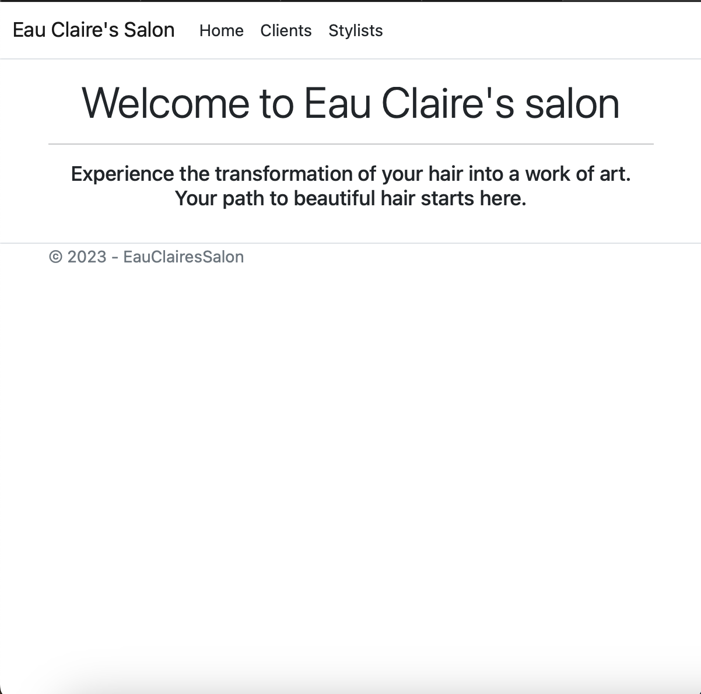

#### By _**Elle Hailu**_

## Eau Claire's Hair Salon

#### _A web app for a hair salon to keep track of stylists and customers_

## Technologies Used

- _C#_
- _.NET_
- _Bootstrap_

## Description

- A web application for a hair salon that includes the following functionality:

  - The ability to add and remove stylists

  - The abilty to add or remove orders for each vendor

## Setup/Installation Requirements

- _Clone this repository to your desktop_
- _Open your terminal and navigate to the top level of the directory_
- _Navigate to HairSalon directory in your terminal and run "dotnet restore" command_
- _create a new file named "appsettings.json" in your production directory._
- _open MySQL Workbench and import elle_hailu.sql._
- update your app.settings.json file contents with: {
  "ConnectionStrings": {
  "DefaultConnection": "Server=localhost;Port=3306;database=[YOUR-DB-NAME];uid=[YOUR-USER-HERE];pwd=[YOUR-PASSWORD-HERE];"
  }
  }
- _To launch application remain in your production folder and run the command "dotnet run" in your terminal._

## Known Bugs

- _Unable to delete stylists from stylist list._

## License

MIT 

Copyright (c) _2023_ _Elle Hailu_

_Permission is hereby granted, free of charge, to any person obtaining a copy of this software and associated documentation files (the “Software”), to deal in the Software without restriction, including without limitation the rights to use, copy, modify, merge, publish, distribute, sublicense, and/or sell copies of the Software, and to permit persons to whom the Software is furnished to do so, subject to the following conditions:_

_The above copyright notice and this permission notice shall be included in all copies or substantial portions of the Software._

_THE SOFTWARE IS PROVIDED “AS IS”, WITHOUT WARRANTY OF ANY KIND, EXPRESS OR IMPLIED, INCLUDING BUT NOT LIMITED TO THE WARRANTIES OF MERCHANTABILITY, FITNESS FOR A PARTICULAR PURPOSE AND NONINFRINGEMENT. IN NO EVENT SHALL THE AUTHORS OR COPYRIGHT HOLDERS BE LIABLE FOR ANY CLAIM, DAMAGES OR OTHER LIABILITY, WHETHER IN AN ACTION OF CONTRACT, TORT OR OTHERWISE, ARISING FROM, OUT OF OR IN CONNECTION WITH THE SOFTWARE OR THE USE OR OTHER DEALINGS IN THE SOFTWARE._
